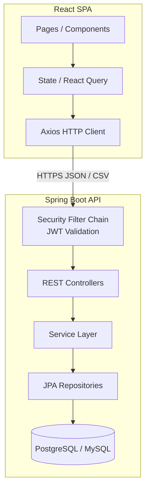
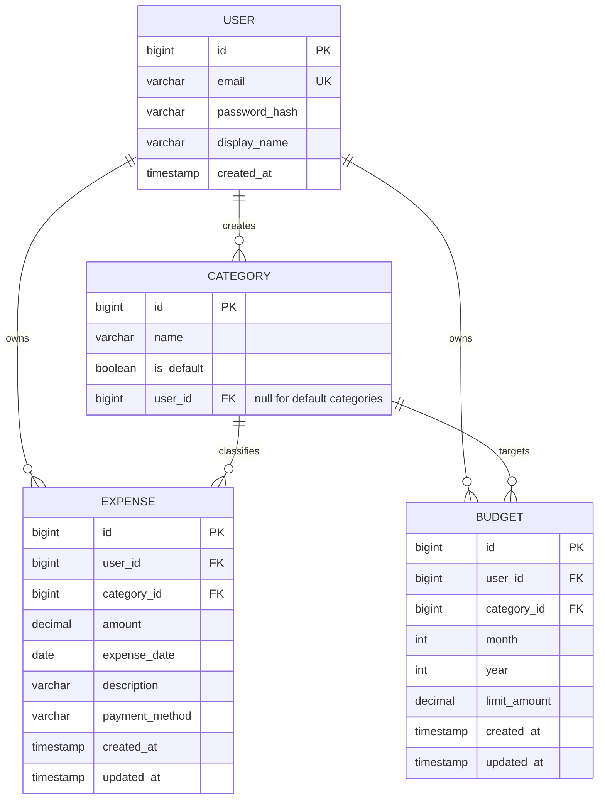

# Design Document: Expense Tracker

## Overview

The Expense Tracker is a full-stack application composed of a Spring Boot REST API backend and a React + Tailwind CSS frontend. Users register, authenticate via JWT, and then manage their personal expense records, categories, and monthly budgets. The backend exposes a versioned REST API (`/api/v1/...`) that enforces per-user data isolation; the frontend is a single-page application (SPA) that consumes that API.

The backend is an existing Spring Boot 4.x project (Java 21, Spring Data JPA, Lombok) currently using H2 in-memory storage. For production the database will be PostgreSQL or MySQL. The frontend is a separate React application.

### Key Design Goals

- **Data isolation**: every query is scoped to the authenticated user's identity from the JWT — no cross-user data leakage.
- **Consistent API contract**: uniform JSON envelope (`status`, `message`, `data`) and RESTful URL conventions.
- **Extensibility**: layered architecture (Controller → Service → Repository) keeps concerns separated and easy to extend.
- **Correctness**: business rules (budget thresholds, category reassignment, CSV round-trip) are encoded in the service layer and verified by property-based tests.

---

## Architecture



### Request Lifecycle

1. The React SPA sends an HTTP request with an `Authorization: Bearer <jwt>` header.
2. The Spring Security filter chain validates the JWT (signature, expiry, issuer) before the request reaches any controller.
3. The controller delegates to the service layer, which enforces ownership checks and business rules.
4. The repository layer executes JPA queries scoped to the authenticated user's ID.
5. The controller wraps the result in the standard `ApiResponse<T>` envelope and returns it.

---

## Components and Interfaces

### Backend Package Structure

```
com.business.expensetracker
├── config/
│   ├── SecurityConfig.java          # Spring Security + JWT filter registration
│   ├── CorsConfig.java              # CORS allow-list for frontend origin
│   └── JwtConfig.java               # JWT secret, issuer, expiry properties
├── controller/
│   ├── AuthController.java          # POST /api/v1/auth/register, /login
│   ├── ExpenseController.java       # CRUD + export /api/v1/expenses
│   ├── CategoryController.java      # /api/v1/categories
│   ├── BudgetController.java        # /api/v1/budgets
│   └── SummaryController.java       # GET /api/v1/summary
├── service/
│   ├── AuthService.java
│   ├── ExpenseService.java
│   ├── CategoryService.java
│   ├── BudgetService.java
│   └── SummaryService.java
├── repository/
│   ├── UserRepository.java
│   ├── ExpenseRepository.java
│   ├── CategoryRepository.java
│   └── BudgetRepository.java
├── model/
│   ├── User.java
│   ├── Expense.java
│   ├── Category.java
│   └── Budget.java
├── dto/
│   ├── request/   # RegisterRequest, LoginRequest, ExpenseRequest, …
│   └── response/  # ApiResponse, AuthResponse, ExpenseSummaryResponse, …
├── security/
│   ├── JwtTokenProvider.java        # generate / validate JWTs
│   └── JwtAuthenticationFilter.java # OncePerRequestFilter
├── exception/
│   ├── GlobalExceptionHandler.java  # @RestControllerAdvice
│   └── (domain exceptions)
└── util/
    └── CsvExporter.java             # CSV serialization logic
```

### REST API Endpoints

| Method | Path | Description |
|--------|------|-------------|
| POST | `/api/v1/auth/register` | Register new user |
| POST | `/api/v1/auth/login` | Authenticate, receive JWT |
| GET | `/api/v1/expenses` | List expenses (filters + pagination) |
| POST | `/api/v1/expenses` | Create expense |
| GET | `/api/v1/expenses/{id}` | Get single expense |
| PUT | `/api/v1/expenses/{id}` | Update expense |
| DELETE | `/api/v1/expenses/{id}` | Delete expense |
| GET | `/api/v1/expenses/export` | Export CSV |
| GET | `/api/v1/categories` | List categories (default + custom) |
| POST | `/api/v1/categories` | Create custom category |
| DELETE | `/api/v1/categories/{id}` | Delete custom category |
| GET | `/api/v1/budgets` | List budgets for month/year |
| POST | `/api/v1/budgets` | Create budget |
| PUT | `/api/v1/budgets/{id}` | Update budget |
| DELETE | `/api/v1/budgets/{id}` | Delete budget |
| GET | `/api/v1/summary` | Spending summary |

### Standard Response Envelope

```json
{
  "status": "success",
  "message": "Expense created successfully",
  "data": { ... }
}
```

Error responses use `"status": "error"` and set `data` to `null` or a validation error map.

### Frontend Component Structure

```
src/
├── api/           # Axios instance + per-resource API functions
├── components/
│   ├── common/    # Button, Modal, ConfirmDialog, LoadingSpinner, ProgressBar
│   ├── charts/    # CategoryPieChart, MonthlyTrendChart (Recharts)
│   └── layout/    # Navbar, Sidebar, PageWrapper
├── pages/
│   ├── LoginPage.tsx
│   ├── RegisterPage.tsx
│   ├── DashboardPage.tsx
│   ├── ExpensesPage.tsx
│   ├── CategoriesPage.tsx
│   └── BudgetsPage.tsx
├── hooks/         # useExpenses, useCategories, useBudgets, useSummary
├── store/         # Auth context / JWT storage
└── types/         # TypeScript interfaces mirroring backend DTOs
```

---

## Data Models

### Entity Relationship Diagram



### JPA Entity Notes

**User**
- `email` has a unique constraint.
- `passwordHash` is stored as a bcrypt hash (cost ≥ 10); never serialized in responses.

**Category**
- `isDefault = true` rows are seeded at startup (via `DataInitializer`) and have `userId = null`.
- Custom categories have `userId` set to the owning user.
- Unique constraint: `(name, userId)` for custom categories; default names are globally unique.

**Expense**
- `amount` is `DECIMAL(15,2)` — must be positive.
- `paymentMethod` is stored as a `VARCHAR` enum: `CASH`, `CREDIT_CARD`, `DEBIT_CARD`, `BANK_TRANSFER`, `OTHER`. Defaults to `OTHER` if omitted.
- `expenseDate` is a `java.time.LocalDate` (date only, no time component).

**Budget**
- Unique constraint: `(userId, categoryId, month, year)` — one budget per user per category per month.
- `month` is 1–12; `year` is a four-digit integer.

### Key DTOs

**ExpenseRequest** (create / update)
```java
record ExpenseRequest(
    @NotNull @Positive BigDecimal amount,
    @NotNull LocalDate date,
    @NotNull Long categoryId,
    @NotBlank String description,
    PaymentMethod paymentMethod   // optional
) {}
```

**PagedExpenseResponse**
```java
record PagedExpenseResponse(
    List<ExpenseDto> expenses,
    long totalElements,
    int totalPages,
    int currentPage
) {}
```

**BudgetStatusDto** (returned by GET /api/v1/budgets)
```java
record BudgetStatusDto(
    BudgetDto budget,
    BigDecimal totalSpent,
    boolean warningThresholdReached,  // spent >= 80% of limit
    boolean limitExceeded             // spent >= 100% of limit
) {}
```

**SummaryResponse**
```java
record SummaryResponse(
    List<CategorySpend> byCategory,   // {categoryName, totalAmount}
    List<MonthlySpend> byMonth,       // {month, totalAmount} — year-only queries
    BigDecimal grandTotal,
    String topCategory
) {}
```

---

## Correctness Properties

*A property is a characteristic or behavior that should hold true across all valid executions of a system — essentially, a formal statement about what the system should do. Properties serve as the bridge between human-readable specifications and machine-verifiable correctness guarantees.*

### Property 1: Resource ownership isolation

*For any* two distinct authenticated users A and B, and any resource (Expense, Category, or Budget) owned by user A, any read, update, or delete request issued by user B for that resource SHALL return 403 Forbidden and SHALL NOT return, modify, or reveal the resource data.

**Validates: Requirements 2.6, 2.9, 9.1, 9.2**

---

### Property 2: Expense amount validation rejects non-positive values

*For any* create-expense or update-expense request where the amount is zero or negative, the Backend_API SHALL return a 400 Bad Request response and SHALL NOT persist any new or modified expense record.

**Validates: Requirements 2.3**

---

### Property 3: Expense list is scoped to the authenticated user and ordered by date descending

*For any* authenticated user with a set of expenses, the get-all-expenses response SHALL contain exactly the expenses belonging to that user (no more, no fewer), and the expenses SHALL be ordered by date in descending order.

**Validates: Requirements 2.4, 9.1**

---

### Property 4: Date range filter returns only expenses within the inclusive range

*For any* authenticated user with a non-empty set of expenses and any valid [startDate, endDate] range, every expense returned by the filtered list endpoint SHALL have a date within the inclusive range [startDate, endDate], and no expense outside that range SHALL appear in the results.

**Validates: Requirements 4.1**

---

### Property 5: Amount range filter returns only expenses within the inclusive range

*For any* authenticated user with a non-empty set of expenses and any valid [minAmount, maxAmount] range, every expense returned by the filtered list endpoint SHALL have an amount within the inclusive range [minAmount, maxAmount], and no expense outside that range SHALL appear in the results.

**Validates: Requirements 4.4**

---

### Property 6: Keyword filter returns only expenses whose description contains the keyword (case-insensitive)

*For any* authenticated user and any keyword string, every expense returned by the keyword-filtered list endpoint SHALL have a description that contains the keyword (case-insensitive), and no expense whose description does not contain the keyword SHALL appear in the results.

**Validates: Requirements 4.3**

---

### Property 7: Pagination response metadata is consistent with the result set

*For any* paginated get-expenses request with a given page index and page size, the response SHALL contain at most `size` expenses, `totalElements` SHALL equal the total number of matching expenses across all pages, `totalPages` SHALL equal `ceil(totalElements / size)`, and `currentPage` SHALL equal the requested page index.

**Validates: Requirements 4.5, 4.6**

---

### Property 8: Budget threshold flags are consistent with spending

*For any* budget with a positive limit amount and any total amount spent for that category/month, the `warningThresholdReached` flag SHALL be true if and only if `totalSpent >= 0.80 * limitAmount`, and the `limitExceeded` flag SHALL be true if and only if `totalSpent >= limitAmount`.

**Validates: Requirements 6.4, 6.5**

---

### Property 9: Category deletion reassigns all associated expenses to "Other"

*For any* custom category that has one or more associated expenses, when that category is deleted, every expense that previously belonged to it SHALL be reassigned to the "Other" default category, and no expense SHALL reference the deleted category afterward.

**Validates: Requirements 3.7**

---

### Property 10: CSV export round-trip fidelity

*For any* set of expense records belonging to an authenticated user, exporting those records to CSV and re-parsing the CSV SHALL produce records whose `id`, `date`, `amount`, `category`, `description`, and `paymentMethod` fields are identical to the original expense records.

**Validates: Requirements 8.4**

---

### Property 11: Spending summary grand total equals the sum of per-category totals

*For any* authenticated user and any month/year period, the `grandTotal` returned by the summary endpoint SHALL equal the arithmetic sum of all `totalAmount` values in the `byCategory` list for that period.

**Validates: Requirements 5.1, 5.3**

---

### Property 12: Password is never exposed in any API response

*For any* API response from any endpoint, the JSON body SHALL NOT contain a field named `password`, `passwordHash`, or any variant thereof.

**Validates: Requirements 9.4**

---

### Property 13: API responses always conform to the standard envelope structure

*For any* request to any Backend_API endpoint, the JSON response body SHALL contain exactly the fields `status`, `message`, and `data`, where `status` is either `"success"` or `"error"`.

**Validates: Requirements 10.2**

---

## Error Handling

### Global Exception Handler (`@RestControllerAdvice`)

All exceptions are caught by `GlobalExceptionHandler` and mapped to the standard `ApiResponse` envelope:

| Exception | HTTP Status | Notes |
|-----------|-------------|-------|
| `MethodArgumentNotValidException` | 400 | Bean Validation failures; returns field-level error map in `data` |
| `HttpMessageNotReadableException` | 400 | Malformed JSON or invalid enum value |
| `ResourceNotFoundException` | 404 | Entity not found (custom exception) |
| `AccessDeniedException` | 403 | Ownership check failed |
| `DuplicateResourceException` | 409 | Email already exists, duplicate category/budget |
| `BadCredentialsException` | 401 | Invalid login credentials |
| `ExpiredJwtException` / `JwtException` | 401 | Invalid or expired token |
| `Exception` (catch-all) | 500 | Generic message returned; full stack trace logged internally |

### Validation Strategy

- Jakarta Bean Validation annotations (`@NotNull`, `@Positive`, `@NotBlank`, `@Size`) on all request DTOs.
- Custom `@ValidDateRange` constraint for `startDate`/`endDate` query parameters.
- Service-layer ownership checks throw `AccessDeniedException` before any mutation.

### Frontend Error Handling

- Axios response interceptor catches 401 responses globally, clears the JWT, and redirects to `/login`.
- Form submission errors (400) are parsed from the `data` field and displayed adjacent to the relevant input.
- Network errors and 500 responses show a toast notification.
- All async operations are wrapped in React Query; loading states drive the `LoadingSpinner` component.

---

## Testing Strategy

### Backend

**Unit Tests (JUnit 5 + Mockito)**
- Service layer: mock repositories, verify business logic (ownership checks, budget threshold calculation, category reassignment).
- `CsvExporter`: verify column headers, field ordering, and special-character escaping with concrete examples.
- `JwtTokenProvider`: verify token generation, validation, and expiry with example tokens.

**Property-Based Tests (jqwik)**

jqwik is a property-based testing library for Java that integrates with JUnit 5. Each property test runs a minimum of 100 iterations with randomly generated inputs.

Each property test is tagged with a comment in the format:
`// Feature: expense-tracker, Property <N>: <property_text>`

Properties to implement:

| Property | Test Class | What varies |
|----------|-----------|-------------|
| P1: Resource ownership isolation | `OwnershipIsolationPropertyTest` | Random user pairs, random resource types and IDs |
| P2: Amount validation rejects non-positive | `ExpenseValidationPropertyTest` | Random zero/negative BigDecimal values |
| P3: Expenses scoped to user and ordered by date desc | `ExpenseListPropertyTest` | Random expense sets for multiple users |
| P4: Date range filter correctness | `ExpenseFilterPropertyTest` | Random date ranges, random expense sets |
| P5: Amount range filter correctness | `ExpenseFilterPropertyTest` | Random amount ranges, random expense sets |
| P6: Keyword filter correctness | `ExpenseFilterPropertyTest` | Random keyword strings, random descriptions |
| P7: Pagination metadata consistency | `PaginationPropertyTest` | Random page/size combinations, random expense sets |
| P8: Budget threshold flags consistency | `BudgetThresholdPropertyTest` | Random limit amounts, random spent amounts |
| P9: Category deletion reassigns expenses | `CategoryDeletionPropertyTest` | Random expense sets per category |
| P10: CSV round-trip fidelity | `CsvExportPropertyTest` | Random expense records (all field combinations, special chars) |
| P11: Summary grand total equals sum of category totals | `SummaryPropertyTest` | Random expense sets per category/month |
| P12: Password never in response | `PasswordExposurePropertyTest` | Random user registrations, logins, and API calls |
| P13: API response envelope structure | `ApiEnvelopePropertyTest` | Random requests to all endpoints |

**Integration Tests (Spring Boot Test + Testcontainers)**
- Full request/response cycle for each endpoint using a real PostgreSQL container.
- Auth flow: register → login → use JWT → logout.
- CORS headers present on responses.
- 500 error logging verified via log capture.

**Repository Tests (`@DataJpaTest`)**
- Custom JPQL queries (date range, keyword, amount range, pagination) verified against H2.

### Frontend

**Unit Tests (Vitest + React Testing Library)**
- Form validation: empty fields, invalid amounts, duplicate names.
- `ConfirmDialog`: renders and calls correct callback on confirm/cancel.
- API error display: 400 response maps field errors to correct inputs.

**Component Tests**
- `CategoryPieChart` and `MonthlyTrendChart`: snapshot tests to catch unintended rendering changes.
- `ProgressBar`: renders correct width percentage for given spent/limit values.

**End-to-End Tests (Playwright)**
- Happy-path flows: register → login → create expense → view on dashboard → export CSV.
- Budget warning and exceeded states visible on Budgets page.
